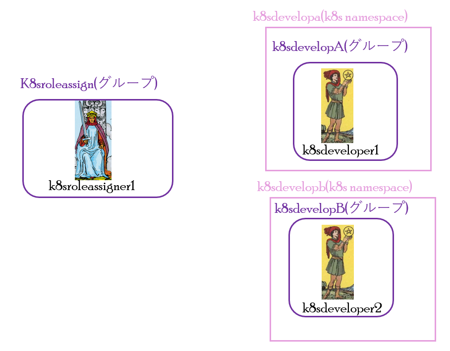

# 1. ABAC未適用による権限昇格
ここでは、ABAC未適用による権限昇格のハンズオンを実施します。
  - [1.1. 事前準備](#11-事前準備)
  - [1.2. ハンズオン](#12-ハンズオン)
    - [1.2.1. k8sroleassigner1へのアカウント切り替え](#121-k8sroleassigner1へのアカウント切り替え)
    - [1.2.2. k8s特権ロール(Azure Kubernetes Service RBAC Admin)の割り当て](#122-k8s特権ロールazure-kubernetes-service-rbac-adminの割り当て)
    - [1.2.3. ロールの割り当ての削除](#123-ロールの割り当ての削除)


## 1.1. 事前準備
ハンズオン実施前に、terraformによる必要な環境のデプロイを行います。<br>



次の手順を実施してください。
```bash
# ハンズオンに必要な必要な環境のデプロイ
## ./ABAC/Condition/non_role-Conditionへの移動
cd ./ABAC/Condition/non_role-Condition
## ./ABAC/Condition/terraform_backendconfig.tfの編集
### ./ABAC/Condition/terraform_backendconfig.tfの「storage_account_name」の<ストレージアカウント名>を、メモしたストレージアカウント名に修正

## AKSへのログイン
kubectl get node --kubeconfig=../../kubeconfig
## terraform initの実行
terraform init -backend-config="../terraform_backendconfig.tf"
## terraform applyの実行
terraform apply
```
## 1.2. ハンズオン
### 1.2.1. k8sroleassigner1へのアカウント切り替え
次の手順を実施してください。
```bash
# k8sroleassigner1へのAzureアカウントの切り替え
az login #ユーザー名にk8sroleassigner1ユーザーのプリンシパル名、パスワードにtfstateファイル(Azure storage→コンテナー→k8srbaccondition-tfstate→terraform.tfstateファイルをダウンロード)に書かれているパスワードを入力
# k8sroleassigner1へのkubernetesアカウントの切り替え
$env:KUBECONFIG = '../../kubeconfig'
kubelogin convert-kubeconfig -l azurecli
```
### 1.2.2. k8s特権ロール(Azure Kubernetes Service RBAC Admin)の割り当て
次の手順を実施してください。
```bash
# k8sroleassignグループに割り当てられているロールの確認
$k8sroleassign=az ad group show --group "k8sroleassign" --query "id" --output tsv
az role assignment list --all --assignee $k8sroleassign --output json --query '[?contains(roleDefinitionName,`k8sroleassigner`)].{principalName:principalName, roleDefinitionName:roleDefinitionName, scope:scope, condition:condition}'
## conditionがnullであることを確認

# k8s特権ロール(Azure Kubernetes Service RBAC Admin)の割り当て
## 変数格納
$k8sdevelopA=az ad group show --group "k8sdevelopA" --query "id" --output tsv
$k8sdevelopB=az ad group show --group "k8sdevelopB" --query "id" --output tsv
$aksclusterid=az aks show -g "aksRBACtest" -n "aks_cp01" --query id
$k8sdevelopAns="k8sdevelopa"
$k8sdevelopbns="k8sdevelopb"
## k8s特権ロールの割り当て
az role assignment create --assignee $k8sdevelopA --role "Azure Kubernetes Service RBAC Admin" --scope "${aksclusterid}/namespaces/${k8sdevelopAns}"
az role assignment create --assignee $k8sdevelopB --role "Azure Kubernetes Service RBAC Admin" --scope "${aksclusterid}/namespaces/${k8sdevelopBns}"
## ロールの割り当ての確認
az role assignment list --all --assignee $k8sdevelopA --output json --query '[].{principalName:principalName, roleDefinitionName:roleDefinitionName, scope:scope}'
az role assignment list --all --assignee $k8sdevelopB --output json --query '[].{principalName:principalName, roleDefinitionName:roleDefinitionName, scope:scope}'
### k8s特権ロールが割り当てられていることを確認
### ABAC未適用では、特権ロールを自由に割り当てられることがわかります。
```
### 1.2.3. ロールの割り当ての削除
次の手順を実施してください。
> 次のハンズオン実施のため、ロールの割り当ての削除が必要です。
```bash
# ロールの割り当ての削除
## ロールの割り当ての削除
az role assignment delete --assignee $k8sdevelopA --role "Azure Kubernetes Service RBAC Admin" --scope "${aksclusterid}/namespaces/${k8sdevelopAns}"
az role assignment delete --assignee $k8sdevelopB --role "Azure Kubernetes Service RBAC Admin" --scope "${aksclusterid}/namespaces/${k8sdevelopBns}"
## ロールの割り当ての確認
az role assignment list --all --assignee $k8sdevelopA --output json --query '[].{principalName:principalName, roleDefinitionName:roleDefinitionName, scope:scope}'
az role assignment list --all --assignee $k8sdevelopB --output json --query '[].{principalName:principalName, roleDefinitionName:roleDefinitionName, scope:scope}'
### 空白であることを確認
```

次のハンズオン手順は、[ロールの制約](./ロールの制約.md)になります。