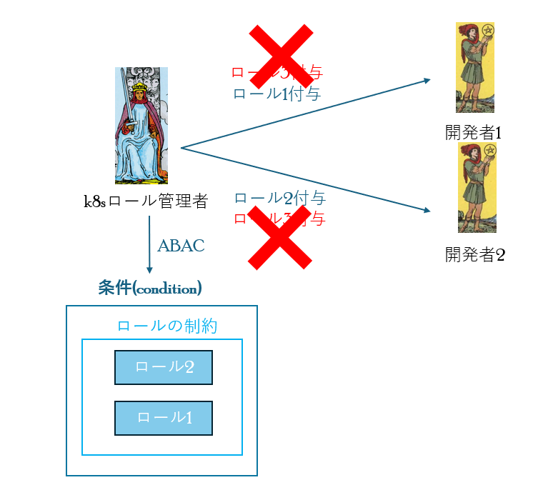
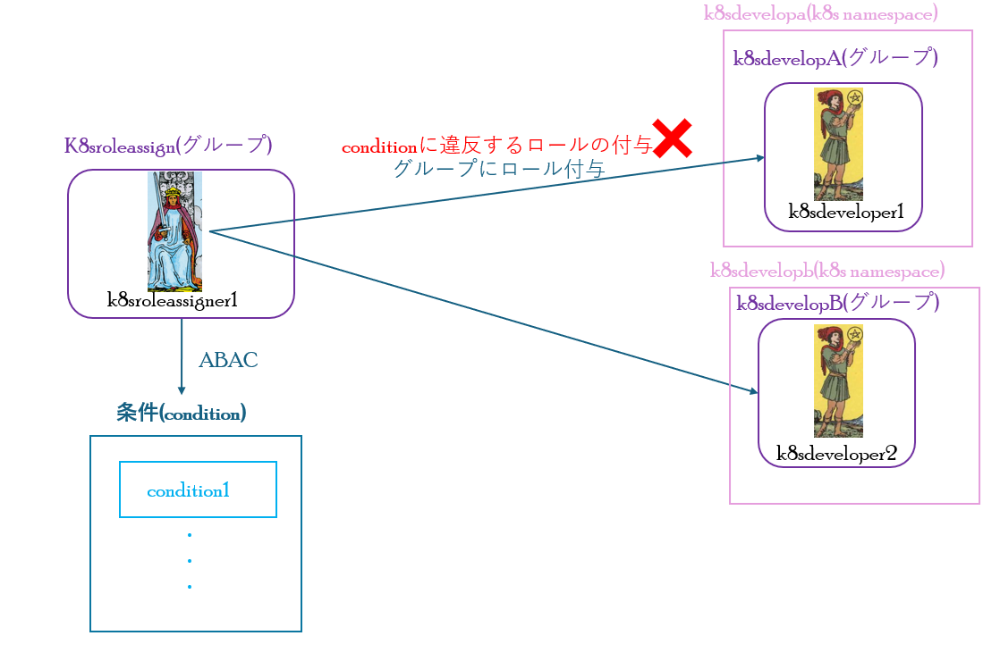

# AKSにおけるK8sロールの権限昇格の防止
k8s環境において、role bindingやcluster role bindingの権限が付与されていると、
自身や他のk8sユーザーに新たに権限を付与でき、権限昇格の脆弱性に繋がります。<br>
Azure kubernetes service(AKS)では、k8s認可にAzure RBACを使用すると、ABAC機能によりロールの権限昇格を防止できます。
  - [権限昇格を防止の概要](#権限昇格を防止の概要)
  - [ハンズオン](#ハンズオン)
    - [事前準備](#事前準備)
      - [前提条件](#前提条件)
      - [tfstate保存用のAzure Storageの作成](#tfstate保存用のazure-storageの作成)
      - [AKS環境の作成](#aks環境の作成)
    - [ハンズオン実施](#ハンズオン実施)
      - [1. ABAC未適用による権限昇格](#1-abac未適用による権限昇格)
      - [2. ロールの制約](#2-ロールの制約)
      - [3. ロールとプリンシパルのタイプの制約](#3-ロールとプリンシパルのタイプの制約)
      - [4. ロールとプリンシパルの制約](#4-ロールとプリンシパルの制約)


## 権限昇格を防止の概要
AKSにおけるK8sロール権限昇格の防止概要について、下記に示します。



k8sロール管理者は、ロール割り当て権限がありますが、ABACにより割り当てられるロールが制限(ロールの制約)されています。<br>
このことにより、条件にないロール(ロール3)を割り当てようとすると、割り当てがブロックされます。<br>
上図では、「ロールの制約」という条件ですが、conditionの書き方次第で、様々な割り当て条件を追加できます。<br>

主なconditionを下記に示します。
- ロールの制約(上図)<br>
選択されたロールの割り当てのみを許可
- ロールとプリンシパルのタイプの制約<br>
選択されたプリンシパル種類 (ユーザー、グループ、またはサービス プリンシパル) への選択されたロールの割り当てのみを許可
- ロールとプリンシパルの制約<br>
選択されたプリンシパルへの選択されたロールの割り当てのみを許可

## ハンズオン
AKSにおけるK8sロール権限昇格の防止について、次のハンズオンを実施します。<br>
- ABAC未適用による権限昇格
- 前章で説明したABACの主なconditionによる権限昇格の防止

下図にハンズオン環境を示します。


### 事前準備
ハンズオン実施前に、terraformによるAKS環境のデプロイを行います。<br>
次の手順を実施してください。
#### 前提条件
- Azure CLIをインストールし、ログイン(az login)済みであること
- kubectlコマンド、terraformコマンド、kubeloginコマンドがインストールされていること
#### tfstate保存用のAzure Storageの作成
tfstate保存用のAzure Storageの作成します。
```bash
# tfstate保存用のstorage作成
## ./ABAC/tfstateへの移動
cd ./ABAC/tfstate
## terraform initの実行
terraform init
## terraform applyの実行
### 出力されるストレージアカウント名をメモする。
terraform apply
```
#### AKS環境の作成
AKS環境を作成します。
> ACRも一緒にデプロイされるが、ハンズオンに影響ありません。
```bash
# AKS環境の作成
## ./ABAC/Azureへの移動
cd ./ABAC/Azure
## provider.tfの編集
### 「backend "azurerm"」の「storage_account_name」の<ストレージアカウント名>を、前手順で出力されたストレージアカウント名に修正
## terraform initの実行
terraform init
## terraform applyの実行
terraform apply
```
### ハンズオン実施
#### 1. ABAC未適用による権限昇格
[ABAC未適用による権限昇格](./Condition/ABAC未適用による権限昇格.md)
#### 2. ロールの制約
[ロールの制約](./Condition/ロールの制約.md)
#### 3. ロールとプリンシパルのタイプの制約
[ロールとプリンシパルのタイプの制約](./Condition/ロールとプリンシパルのタイプの制約.md)
#### 4. ロールとプリンシパルの制約
[ロールとプリンシパルの制約](./Condition/ロールとプリンシパルの制約.md)

### ハンズオン環境の削除
[ハンズオン環境の削除](./Condition/ハンズオン環境の削除手順.md)

## ABAC機能の注意点
- Azure RBACによるロール割り当てが不可のため、k8sサービスアカウントに対応していない
  - k8sサービスアカウントへのロール割り当て権限は、普段の運用では割り当てず、[JITアクセス](https://learn.microsoft.com/ja-jp/azure/aks/access-control-managed-azure-ad#configure-just-in-time-cluster-access-with-microsoft-entra-id-and-aks)を構成し、必要な時にだけ付与するとよい。
- 選択されたロールの割り当てにのみ制限する場合も、セキュリティ原則として、その選択されたロールの権限は最小権限にとどめること。
  - コンテナセキュリティ製品によって、k8s rbacの過剰権限を警告してくれる機能もあるので、活用するとよい。