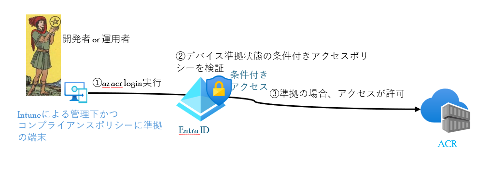
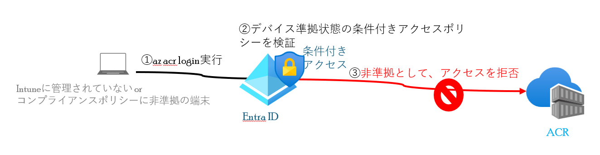

# デバイスベース条件付きアクセスによるACRのアクセス制御
デバイスベース条件付きアクセスによるACRのアクセス制御について、説明します。
  - [アクセス制御の動作](#アクセス制御の動作)
    - [Intuneによる管理下かつコンプライアンスポリシーに準拠している端末からのアクセス](#intuneによる管理下かつコンプライアンスポリシーに準拠している端末からのアクセス)
    - [Intuneに管理されていない or コンプライアンスポリシーに非準拠の端末からのアクセス](#intuneに管理されていない-or-コンプライアンスポリシーに非準拠の端末からのアクセス)
  - [ACRへの条件付きアクセスは、個人的には非推奨](#acrへの条件付きアクセスは個人的には非推奨)
  - [その他条件付きアクセスの注意点](#その他条件付きアクセスの注意点)

## アクセス制御の動作

### Intuneによる管理下かつコンプライアンスポリシーに準拠している端末からのアクセス
1. 端末からACRへaz azr loginを実行
2. Entra ID にて、デバイス準拠状態の条件付きアクセスポリシーを検証
3. アクセス元の端末がIntuneによる管理下でコンプライアンスポリシーに準拠している場合、アクセスが許可され、ACRへのログインに成功する。

### Intuneに管理されていない or コンプライアンスポリシーに非準拠の端末からのアクセス
1. 端末からACRへaz azr loginを実行
2. Entra ID にて、デバイス準拠状態の条件付きアクセスポリシーを検証
3. Intuneに管理されていない or コンプライアンスポリシーに非準拠の場合、アクセスが拒否され、ACRへのログインに失敗する。

## ACRへの条件付きアクセスは、個人的には非推奨
ACRへ条件付きアクセスを適用するには、[authentication-as-arm を無効にする必要があります。](https://learn.microsoft.com/ja-jp/azure/container-registry/container-registry-disable-authentication-as-arm)
これを無効にすると、AKSのkubeletからのACRに対する認証(ACRからコンテナをpullする際の認証)で、マネージドIDを使用できません。(認証に失敗します。) 
なので個人的には条件付きアクセスを適用せず、以下の別の対策を講じることを推奨します。
- 認証認可系の対策
  - Windows Azure Service Management APIに対する条件付きアクセスを適用する。(ACRへEntra ID ユーザーでログインするためには、まずAzure resource managerに ログインする必要があるため、外部からの不正アクセスを防止できる)
  - AKSへの条件付きアクセスを適用する。(ACRへコンテナをプッシュできても、AKSへ不正デプロイを防止できる。また、コンテナレポジトリにイメージがあるだけでは直接の脅威にならない。)
  - 本番環境では、Entra ID ユーザーにACRに対する権限を与えない。CICDでコンテナデプロイするように構成し、その際の認証に使うワークロードIDは、マネージドIDかワークロード ID フェデレーションを利用する。　
- 認証認可以外の対策
  - 脆弱なイメージがレポジトリに長期間残らないように、イメージの世代管理で古いイメージを自動削除するよう構成する。
  - Defender for Containerなどのコンテナイメージスキャンを利用して、脆弱なイメージを監視する。 

## その他条件付きアクセスの注意点
- az azr login後、Entra id ユーザーのトークン有効期限は3時間のため、デバイス準拠から非準拠に変わってもトークンの有効期限まで、ACRへアクセスできる。 
→Intune管理下の端末がマルウェア感染したときに、デバイス非準拠になるよう構成している(Defender for EndpointとIntuneの統合など)場合、次の条件付きアクセスポリシーのチェックまでの間に感染拡大する可能性があるため、感染が発覚したすぐに端末自体のネットワーク隔離を行うこと。
   - 隔離の例として、Defender for Endpointのカスタム検出ルールを使用して、アラートが生じた端末の自動隔離を行う

次の説明について、[Azure Devops Serviceのアクセス制御](./Azure_Devops_Serviceに対するデバイスベースアクセス制御.md)になります。
