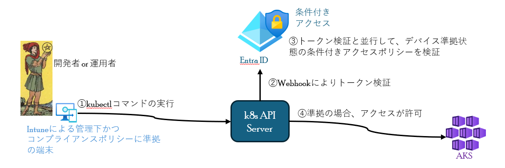
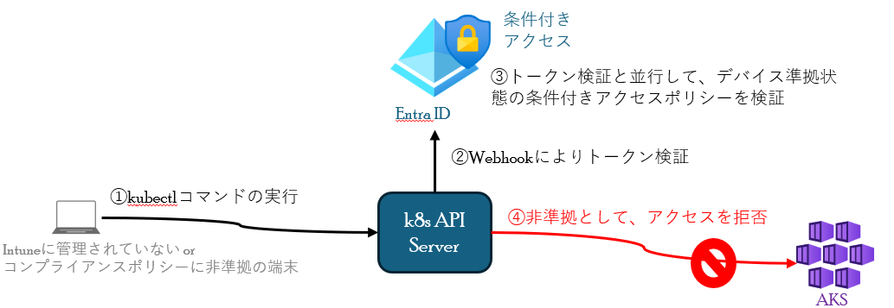

# デバイスベース条件付きアクセスによるAKSのアクセス制御
デバイスベース条件付きアクセスによるAKSのアクセス制御について、説明します。
  - [アクセス制御の動作](#アクセス制御の動作)
    - [Intuneによる管理下かつコンプライアンスポリシーに準拠している端末からのアクセス](#intuneによる管理下かつコンプライアンスポリシーに準拠している端末からのアクセス)
    - [Intuneに管理されていない or コンプライアンスポリシーに非準拠の端末からのアクセス](#intuneに管理されていない-or-コンプライアンスポリシーに非準拠の端末からのアクセス)
  - [条件付きアクセスの注意点](#条件付きアクセスの注意点)

## アクセス制御の動作

### Intuneによる管理下かつコンプライアンスポリシーに準拠している端末からのアクセス
1. 端末からk8s API Serverへkubectlコマンドの実行
2. WebhookによりEntra ID へトークン検証をリクエスト
3. トークン検証と並行して、デバイス準拠状態の条件付きアクセスポリシーを検証
4. アクセス元の端末がIntuneによる管理下でコンプライアンスポリシーに準拠している場合、AKSへのアクセスが許可される。

### Intuneに管理されていない or コンプライアンスポリシーに非準拠の端末からのアクセス
1. 端末からk8s API Serverへkubectlコマンドの実行
2. WebhookによりEntra ID へトークン検証をリクエスト
3. トークン検証と並行して、デバイス準拠状態の条件付きアクセスポリシーを検証
4. アクセス元の端末がIntuneの非管理下または管理下でもコンプライアンスポリシーに非準拠の場合、AKSへのアクセスが拒否される。

## 条件付きアクセスの注意点
- Entra IDへログイン後、アクセストークンの有効期限は60 分から 90 分のため、この間デバイス準拠から非準拠に変わってもトークンの有効期限まで、AKSへアクセスできる。 
→Intune管理下の端末がマルウェア感染したときに、デバイス非準拠になるよう構成している(Defender for EndpointとIntuneの統合など)場合、次の条件付きアクセスポリシーのチェックまでの間に感染拡大する可能性があるため、感染が発覚したすぐに端末自体のネットワーク隔離を行うこと。
   - 隔離の例として、Defender for Endpointのカスタム検出ルールを使用して、アラートが生じた端末の自動隔離を行う
  
次の説明について、[ACRのアクセス制御](./ACRに対するデバイスベースアクセス制御.md)になります。
