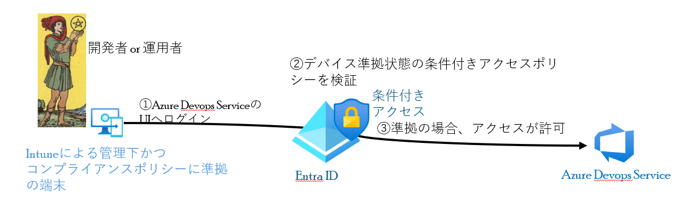
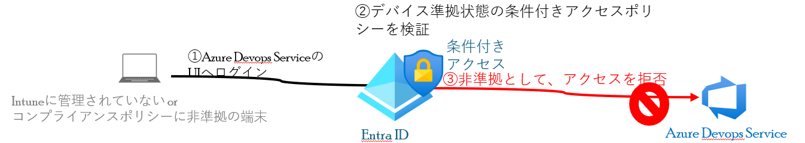
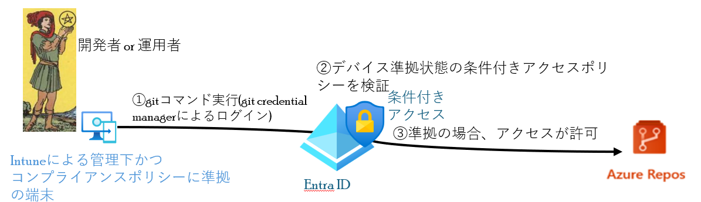
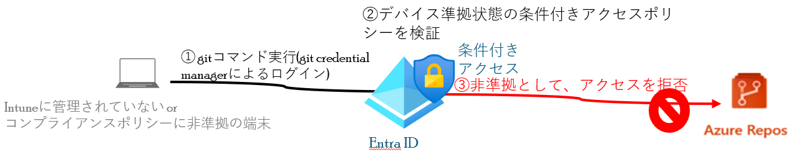
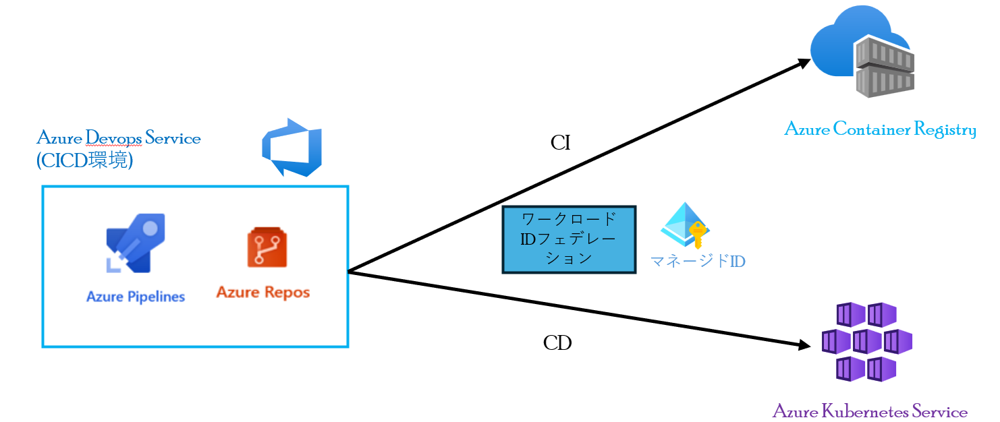

# デバイスベース条件付きアクセスによるAzure Devops Serviceのアクセス制御
デバイスベース条件付きアクセスによるAzure Devops Serviceのアクセス制御について、説明します。
  - [アクセス制御の動作](#アクセス制御の動作)
    - [Azure Devops ServiceのUIへのログイン](#azure-devops-serviceのuiへのログイン)
      - [Intuneによる管理下かつコンプライアンスポリシーに準拠している端末からのアクセス1](#intuneによる管理下かつコンプライアンスポリシーに準拠している端末からのアクセス1)
      - [Intuneに管理されていない or コンプライアンスポリシーに非準拠の端末からのアクセス1](#intuneに管理されていない-or-コンプライアンスポリシーに非準拠の端末からのアクセス1)
    - [Azure Repos git へのログイン※1](#azure-repos-git-へのログイン※1)
      - [Intuneによる管理下かつコンプライアンスポリシーに準拠している端末からのアクセス2](#intuneによる管理下かつコンプライアンスポリシーに準拠している端末からのアクセス2)
      - [Intuneに管理されていない or コンプライアンスポリシーに非準拠の端末からのアクセス2](#intuneに管理されていない-or-コンプライアンスポリシーに非準拠の端末からのアクセス2)
  - [条件付きアクセスの注意点](#条件付きアクセスの注意点)

## アクセス制御の動作
### Azure Devops ServiceのUIへのログイン
#### Intuneによる管理下かつコンプライアンスポリシーに準拠している端末からのアクセス1
1. 端末からAzure Devops ServiceのUIへログイン
2. デバイス準拠状態の条件付きアクセスポリシーを検証
3. アクセス元の端末がIntuneによる管理下でコンプライアンスポリシーに準拠している場合、Azure Devops Serviceへのアクセスが許可され、ログインに成功する。

#### Intuneに管理されていない or コンプライアンスポリシーに非準拠の端末からのアクセス1
1. 端末からAzure Devops ServiceのUIへログイン
2. Entra ID にて、デバイス準拠状態の条件付きアクセスポリシーを検証
3. Intuneに管理されていない or コンプライアンスポリシーに非準拠の場合、アクセスが拒否され、Azure Devops Serviceへのログインに失敗する。

### Azure Repos git へのログイン[※1](#条件付きアクセスの注意点)
#### Intuneによる管理下かつコンプライアンスポリシーに準拠している端末からのアクセス2
1. 端末からgitコマンド実行(git credential managerによるログイン)
2. デバイス準拠状態の条件付きアクセスポリシーを検証
3. アクセス元の端末がIntuneによる管理下でコンプライアンスポリシーに準拠している場合、Azure Repos gitへのアクセスが許可され、ログインに成功する。

#### Intuneに管理されていない or コンプライアンスポリシーに非準拠の端末からのアクセス2
1. 端末からgitコマンド実行(git credential managerによるログイン)
2. Entra ID にて、デバイス準拠状態の条件付きアクセスポリシーを検証
3. Intuneに管理されていない or コンプライアンスポリシーに非準拠の場合、アクセスが拒否され、Azure Repos gitへのログインに失敗する。

## 条件付きアクセスの注意点
- PATやSSHなどの非対話式の認証については、デバイスベースのポリシーに非対応。(IPベースポリシーのみ対応(2024/6現在))。※1 
→デバイスベース条件付きアクセスを使用する場合、非対話式認証の制限を設定すること。 
  - SSHはOrganizationの設定でオフにできる。 
  - PATはオフにはできないが、[最大有効期限や漏洩した際の自動削除などの設定は可](https://learn.microsoft.com/ja-jp/azure/devops/organizations/accounts/manage-pats-with-policies-for-administrators?view=azure-devops)。

- Entra IDへログイン後、アクセストークンの有効期限は60 分から 90 分 のため、この間デバイス準拠から非準拠に変わってもトークンの有効期限まで、Azure Devops ServiceやRepos Gitへアクセスできる。 
→Intune管理下の端末がマルウェア感染したときに、デバイス非準拠になるよう構成している(Defender for EndpointとIntuneの統合など)場合、次の条件付きアクセスポリシーのチェックまでの間に感染拡大する可能性があるため、感染が発覚したすぐに端末自体のネットワーク隔離を行うこと。
   - 隔離の例として、Defender for Endpointのカスタム検出ルールを使用して、アラートが生じた端末の自動隔離を行う
- Entra ワークロードIDの認証による条件付きアクセスについて、サービスプリンシパルのみ対応(2024/6現在)。しかし、CICDなどでワークロードIDで認証する際、資格情報を管理しなくてよいマネージド IDかワークロード ID フェデレーションの利用が好ましい。 
 
ワークロード ID フェデレーションの認証によるCICDのサンプルyamlコードについて、[ここ](./CICD/Workload_identity_federation_CICD.yaml)参照

次の説明について、[コンテナ環境向けの条件付きアクセスの推奨ポリシー](./条件付きアクセスポリシーのサンプル.md)になります。

