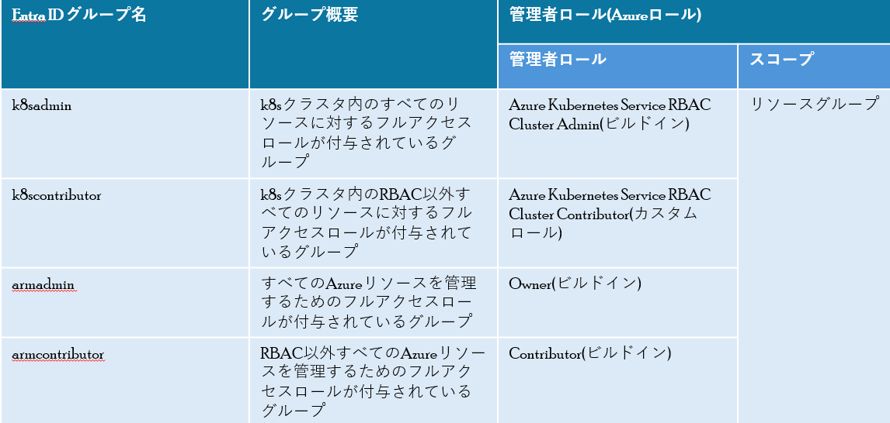

# AKSの管理者ロールに対するJITアクセスのハンズオン実施
AKSの管理者ロールに対するJITアクセスのハンズオンを実施します。
  - [前提条件](#前提条件)
  - [PIM用のEntra ID グループ](#pim用のentra-id-グループ)
  - [グループのPIMの設定確認](#グループのpimの設定確認)
  - [JITアクセスの動作確認](#jitアクセスの動作確認)
    - [1. 1時間のグループへのメンバーシップの有効化(アクティブ化)を申請](#1-1時間のグループへのメンバーシップの有効化アクティブ化を申請)
    - [2. 承認者によるアクティブ化を承認](#2-承認者によるアクティブ化を承認)
    - [3. 承認後、承認された期間のみグループへのメンバーシップが有効化され、管理者ロール(Azure Kubernetes Service RBAC Cluster Contributor)でのAKSへのアクセスが可能](#3-承認後承認された期間のみグループへのメンバーシップが有効化され管理者ロールazure-kubernetes-service-rbac-cluster-contributorでのaksへのアクセスが可能)
    - [4. 承認された期間を過ぎると、非アクティブ化され、管理者ロールでのコンテナ環境へのアクセスが不可になる](#4-承認された期間を過ぎると非アクティブ化され管理者ロールでのコンテナ環境へのアクセスが不可になる)

## 前提条件
- kubectlおよびkubeloginコマンドがインストールされていること
- Entra ID P2ライセンス割り当て済みのテストユーザーが、condiac-pim-testグループのメンバーに追加されていること
  - リソースグループ(PIMtestforaks)のスコープにテストユーザーに対して、Azure Kubernetes Service クラスター ユーザー ロール のRBACを割り当てていること

## PIM用のEntra ID グループ
前手順でデプロイされたPIM用のEntra ID グループについて、下表に示します。



## グループのPIMの設定確認
- PIMのUI → 「グループ」→ <PIM用のEntra ID グループ名>-xxxx →「設定」→「member」をクリック。<br>
下記の画像に示されているように、PIMの各設定値を確認する。
  - 画像1
    
    - 承認者のメンバーには、[JITアクセスハンズオン環境のデプロイの前提条件で、ログイン(az login)済みのユーザー](./JITアクセスハンズオン環境のデプロイ.md#前提条件)が、割り当てられている。
    - 「アクティブ化で必要」項目で、グループのメンバーシップへのアクティブ化の際、MFAを強制する設定となっているが、認証コンテキストによる条件付きアクセスの適用も可能
  - 画像2
    
    - 各「ロールの割り当てのアラート」項目の「その他の受信者」には、[PIM用のグループと設定のデプロイ](./JITアクセスハンズオン環境のデプロイ.md#pim用のグループと設定のデプロイ)で、入力したPIM管理者通知用のメールアドレスが表示される。

## JITアクセスの動作確認
下記の画像に示されているように、k8scontributor-xxxxグループに対するJITアクセスの動作確認を行います。<br>
1. 1時間のグループへのメンバーシップの有効化(アクティブ化)を申請
2. 承認者によるアクティブ化を承認
3. 承認後、承認された期間のみグループへのメンバーシップが有効化され、管理者ロール(Azure Kubernetes Service RBAC Cluster Contributor)でのAKSへのアクセスが可能
4. 承認された期間を過ぎると、非アクティブ化され、管理者ロールでのAKSへのアクセスが不可になる


### 1. 1時間のグループへのメンバーシップの有効化(アクティブ化)を申請
- ブラウザのプライベートウィンドウを開き、P2ライセンスが割り当てられているテストユーザーで、Azure Portalへログインする
- PIMのUI → 「自分のロール」→「グループ」→ k8scontributor-xxxxの横の「アクティブ化」を選択
- MFAの検証後、下記を入力し、「アクティブ化」を選択(その後承認待ちとなる)
    ```ini
    ・期間 (時間)：1
    ・理由:testのため
    ```
### 2. 承認者によるアクティブ化を承認
- ブラウザーの新しいウィンドウ(通常モード)を開き、承認者ユーザー[(JITアクセスハンズオン環境のデプロイの前提条件で、ログイン(az login)済みのユーザー)](./JITアクセスハンズオン環境のデプロイ.md#前提条件)で、Azure Portalへログインする
- PIMのUI → 「申請の承認」→「グループ」→ 申請された項目を選択 → 「承認」をクリック
- 「理由」にtestのためと入力し、「確認」をクリック
  
### 3. 承認後、承認された期間のみグループへのメンバーシップが有効化され、管理者ロール(Azure Kubernetes Service RBAC Cluster Contributor)でのAKSへのアクセスが可能
- テストユーザーのウィンドウに戻り、PIMのUI → 「自分のロール」→「グループ」→ 「アクティブな割り当て」→ k8scontributor-xxxxへのメンバーシップがアクティブ化されているのを確認
- 下記のコマンドを実行
    ```powershell
    # azurecliにlogin
    az login　## テストユーザーでログインすること
    
    # テストユーザー用のkubeconfigの作成
    $k8scluster = "aks_cp01"
    $rg = "PIMtestforaks"
    az aks get-credentials --name $k8scluster --resource-group $rg -f ./pim-kubeconfig --overwrite-existing

    # kubectlコマンド(nodeの確認)実施
    $env:KUBECONFIG = './pim-kubeconfig'
    kubelogin convert-kubeconfig -l interactive
    kubectl get node --kubeconfig="./pim-kubeconfig" #ブラウザが起動するので、ログインする
    ## 下記のように出力されること
    ## エラーが出る場合、約5分ほど置いてから実施すること(ロールが反映されるまで少し時間かかることがある)
    ###NAME                                  STATUS   ROLES   AGE     VERSION
    ###aks-defaultpool-34057271-vmss000000   Ready    agent   3h11m   v1.27.9
    
    # kubectlコマンド(k8sRBACの確認)実施
    kubectl get clusterrole --kubeconfig="./pim-kubeconfig"
    ## 下記のようにエラー出力されること
    ### Error from server (Forbidden): clusterroles.rbac.authorization.k8s.io is forbidden: User "xxxxxxx" cannot list resource "clusterroles" in API group "rbac.authorization.k8s.io" at the cluster scope: User does not have access to the resource in Azure. Update role assignment to allow access.
    ```
### 4. 承認された期間を過ぎると、非アクティブ化され、管理者ロールでのコンテナ環境へのアクセスが不可になる
>この手順について、アクティブ化期間(1時間)の有効期限切れまたは、テストユーザーのPIMのUI → 「自分のロール」→「グループ」→ 「アクティブな割り当て」から手動による非アクティブ化の後、実施

下記のコマンドを実行
```powershell
# kubeloginのトークンキャッシュのクリア
kubelogin remove-tokens
# kubectlコマンド(nodeの確認)実施
kubectl get node --kubeconfig="./pim-kubeconfig" #ブラウザが起動するので、ログインする
## 下記のようにエラー出力されること
## エラーが出ない場合、約5分ほど置いてから実施すること(非アクティブ化の後、ロールの更新が反映されるまで約5分ほどかかる場合がある)
### Error from server (Forbidden): clusterroles.rbac.authorization.k8s.io is forbidden: User "xxxxxxx" cannot list resource "clusterroles" in API group "rbac.authorization.k8s.io" at the cluster scope: User does not have access to the resource in Azure. Update role assignment to allow access.
```  
AKSの管理者ロールに対するJITアクセスのハンズオンについて、すべて以上です。<br>
ハンズオン環境削除について、[JITアクセスハンズオン環境削除](./JITアクセスハンズオン環境削除.md)を参照。