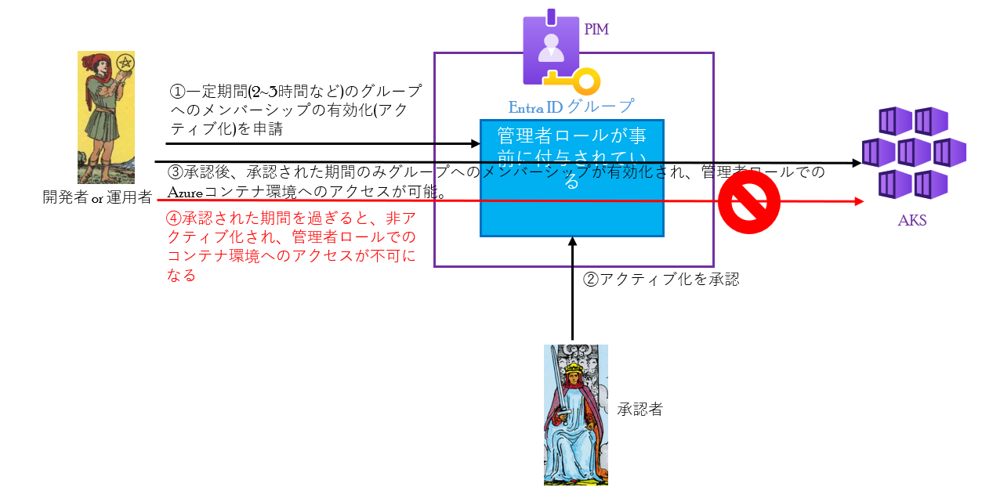
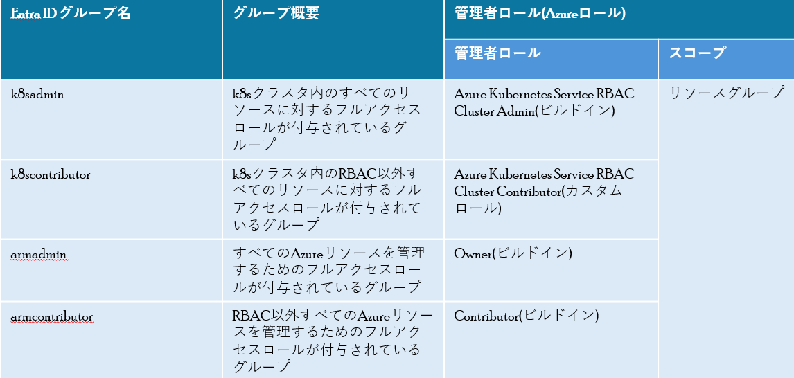

# PIMによるAKSの管理者ロールに対するJITアクセス
Kubernetes(k8s)環境では、通常時管理者ロールは割り当てません。 
しかし、緊急時にそのロールが必要になる場合があります。  
Entra IDのPIMを使用すると、AKSの管理者ロールの一時的な付与(JITアクセス)が可能になります。 
PIMには3種類(Entra ID ロール、Azureロール、グループ)があるが、ここではグループのPIMで説明します。
  - [管理者ロールに対するJITアクセスの流れ](#管理者ロールに対するjitアクセスの流れ)
  - [JITアクセスのハンズオン](#jitアクセスのハンズオン)
    - [PIM用のEntra ID グループ](#pim用のentra-id-グループ)
    - [ハンズオン環境のデプロイ](#ハンズオン環境のデプロイ)
    - [ハンズオン実施](#ハンズオン実施)
    - [ハンズオン環境の削除](#ハンズオン環境の削除)

## 管理者ロールに対するJITアクセスの流れ
下図に管理者ロールに対するJITアクセスの流れを示します。 
1. 開発者or運用者から、一定期間(2~3時間など)の管理者ロールが事前に付与されているグループへのメンバーシップの有効化(アクティブ化)を申請
2. 承認者によるアクティブ化を承認
3. 承認後、開発者or運用者は承認された期間のみグループへのメンバーシップが有効化され、管理者ロールでのAKSへのアクセスが可能。
4. 承認された期間を過ぎると、非アクティブ化され(メンバーシップから自動的に外れる)、管理者ロールでのAKSへのアクセスが不可になる

## JITアクセスのハンズオン
AKSの管理者ロールに対するJITアクセスのハンズオンを実施します。
### PIM用のEntra ID グループ
ハンズオン環境でデプロイされるPIM用のEntra ID グループについて、下表に示します。

### ハンズオン環境のデプロイ
[JITアクセスハンズオン環境のデプロイ](./JITアクセスハンズオン環境のデプロイ.md)

### ハンズオン実施
[JITアクセスハンズオン実施](./JITアクセスハンズオン実施.md)

### ハンズオン環境の削除
[JITアクセスハンズオン環境削除](./JITアクセスハンズオン環境削除.md)

[メインページ](../README.md)のページへ戻る