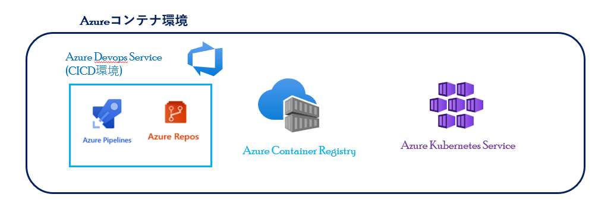
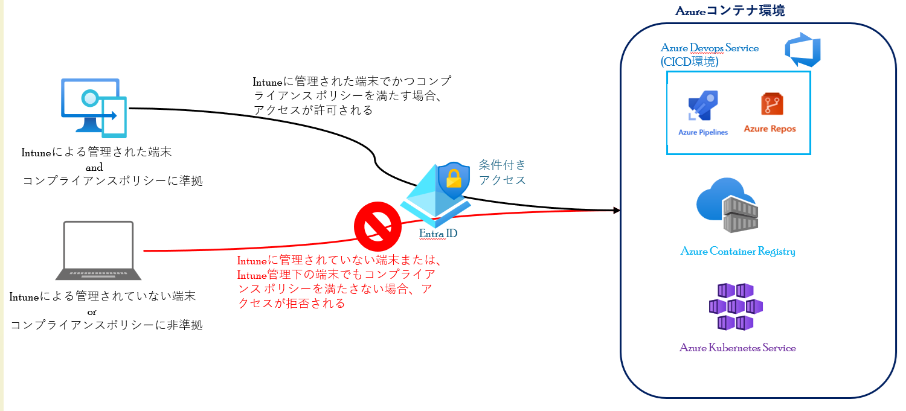

# 条件付きアクセスによるAzureコンテナ環境のアクセス制御
Entra IDの条件付きアクセスを使用すると、インターネットからアクセス可能な状態でも、Azureコンテナ環境の送信元アクセス保護を実現できます。 
今回は、下記の図のコンテナ環境を前提として説明します。 
また最近ではゼロトラストに基づくセキュリティ対策が主流になりつつあるので、ここではIntuneデバイスベースの条件付きアクセスによるアクセス制御について、紹介します。

  - [Intuneデバイスベースの条件付きアクセスによるコンテナ環境のアクセス制御](#intuneデバイスベースの条件付きアクセスによるコンテナ環境のアクセス制御)
    - [Azure Kubernetes Service(AKS)のアクセス制御](#azure-kubernetes-serviceaksのアクセス制御)
    - [Azure Container Registry(ACR)のアクセス制](#azure-container-registryacrのアクセス制)
    - [Azure Devops Service(CICD環境)のアクセス制御](#azure-devops-servicecicd環境のアクセス制御)
  - [条件付きアクセスの推奨ポリシー](#条件付きアクセスの推奨ポリシー)

## Intuneデバイスベースの条件付きアクセスによるコンテナ環境のアクセス制御
Intuneデバイスベースの条件付きアクセスを使用すると、
Intune管理下でかつコンプライアンスポリシーに準拠しているデバイスのみに、コンテナ環境へのアクセスを限定できます。

### Azure Kubernetes Service(AKS)のアクセス制御
[AKSのアクセス制御](./AKSに対するデバイスベースアクセス制御.md)

### Azure Container Registry(ACR)のアクセス制
[ACRのアクセス制御](./ACRに対するデバイスベースアクセス制御.md)

### Azure Devops Service(CICD環境)のアクセス制御
[Azure Devops Serviceのアクセス制御](./Azure_Devops_Serviceに対するデバイスベースアクセス制御.md)

## コンテナ環境向けの条件付きアクセスの推奨ポリシー
[コンテナ環境向けの条件付きアクセスの推奨ポリシー](./条件付きアクセスポリシーのサンプル.md)

[メインページ](../README.md)のページへ戻る

